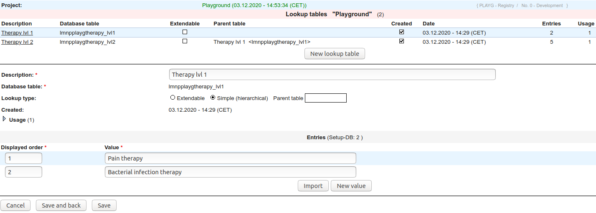
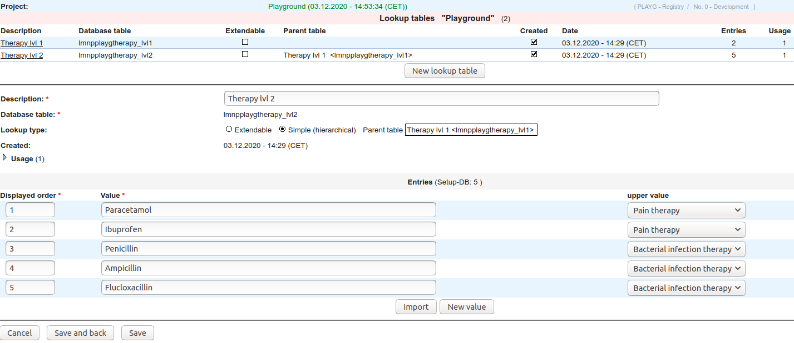

# Creating lookup tables 

Some of the data that is intended for capture in a database you
are implementing may be of hierarchical nature. A good example
is the treatment of patients for certain conditions with a condition specific drug.
You can imagine that one patient (P1) may be treated for pain with Paracetamol,
while another (P2) is treated with Ibuprofen. Yet another patient (P3) is treated
for a bacterial infection with penicillin.

P1: Pain -> Paracetamol
P2: Pain -> Ibuprofen
P3: Bacterial infection -> penicillin

Hierarchically you can set up two levels. First level defining what the treatment
is for (e.g. pain) and what it is treated with (e.g. paracetamol).

1. FormBuilder
2. Click "Edit lookup tables"
3. Click "New lookup table" and enter specifications and save.

    

4. For the next level you can again click "New lookup table" and enter specifications and save.
   Note that you can now indicate the "Parent table" and the "upper value" to establish a hierarchy.

    

5. Further levels can be added by following the same approach.
6. When including the lookup tables into a form, you need to select one of the 
   "Hierarchical lookup tables" types when setting up the question.

    

This recipe was tested under secuTrial version 5.6.2.2
